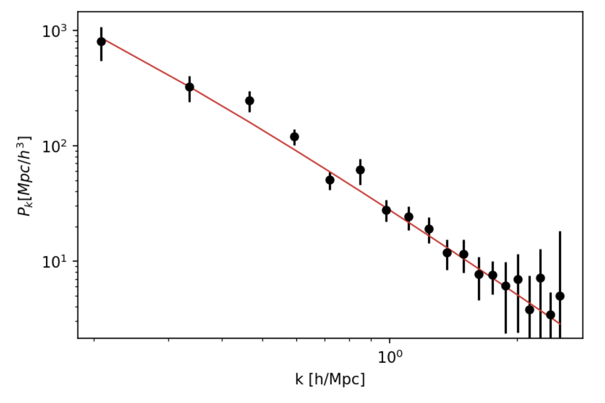

# CosmoLab meeting: 12/06/19

Attending: Vera Gluscevic, Tim Morton, Siavash Yasini, Aryan Rahimieh, Remy Gerras, Sydney Feldman, Javier Zhao, Chris Lindsay, David Liu, Jack Lashner, Connor Powers, Isabella Johansson, Yeojin Choi. 


## Classy and Bayesian inference in practice

This was a hands-on meeting. We did a quick recap on what was done so far in hacks. We then introduced python wrapper for CLASS code, called classy. We used classy to output Pk for a cosmology corresponding to the Chabanier et al paper (the source of our Pk measurements from Ly-alpha). We then overplotted Pk calculated from classy over our data points. Match! 

Note on Pk normalization: classy and the data points use different factors of h (Hubble parameter) when dealing with Pk; if you want the data to match the calculation, make sure you reconcile the normalizations.

Suggested exercises: 
- Plot Cl/Pk using classy

Here is a sample code to produce Pk with the correct normalization using classy

```python
import numpy as np
from classy import Class

# initialize class
cosmo = Class()

# Planck 2018 parameters from https://arxiv.org/pdf/1807.06209.pdf
parameters = {'omega_b': 0.02233,
              'omega_cdm': 0.1198,
              'h': 0.6737,
              'A_s':2.097E-9,
              'n_s':0.9652,
              'tau_reio':0.0540}

# set the class parameters 
cosmo.set({'output':'mPk',
           "P_k_max_1/Mpc":10.0,
           **parameters})

# run class
cosmo.compute()

# set up an array for k
k_min = 0.1
k_max = 5
n_points = 100

K = np.logspace(np.log(k_min), np.log10(k_max), n_points) 

#calculate Pk at all k values (note the normalization for k and P_k
h = parameters["h"]
P_k = [cosmo.pk(k, 0)*h**3 for k in K]
```
Now we can overplot this on top of our data




